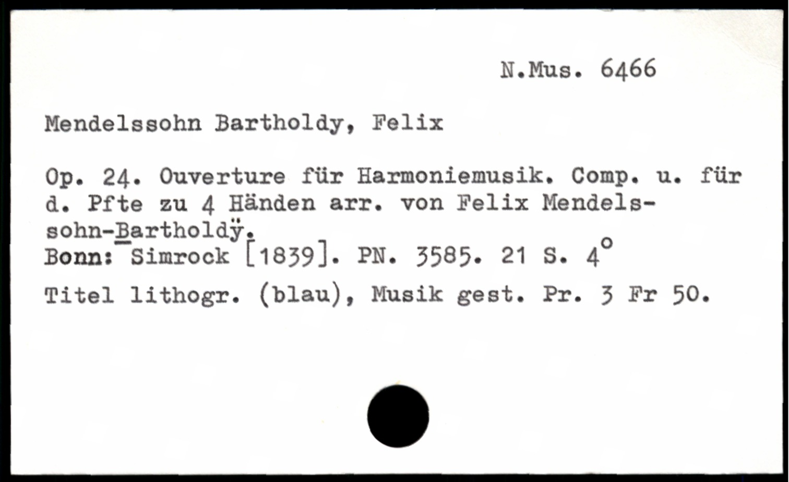
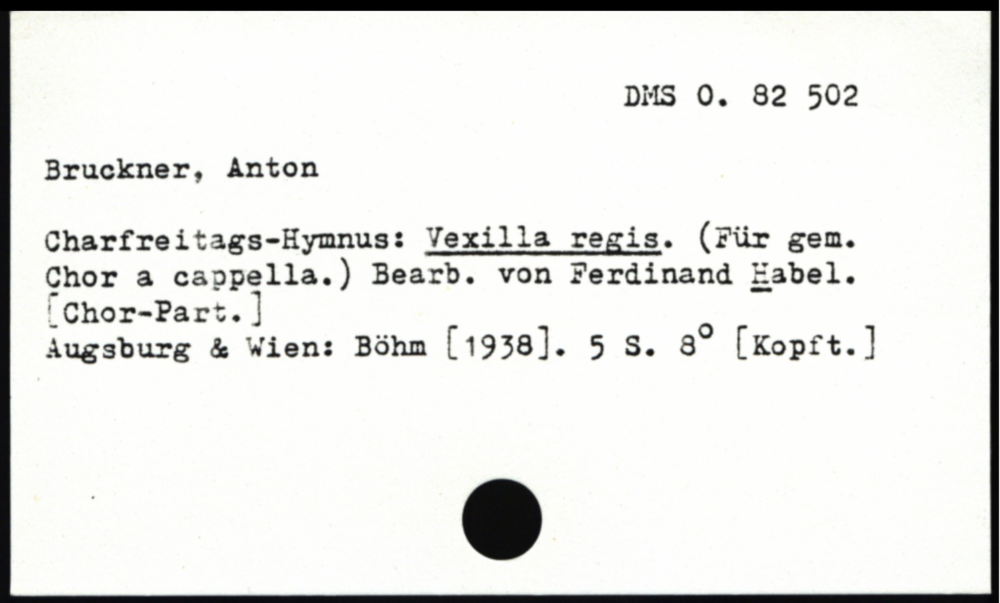
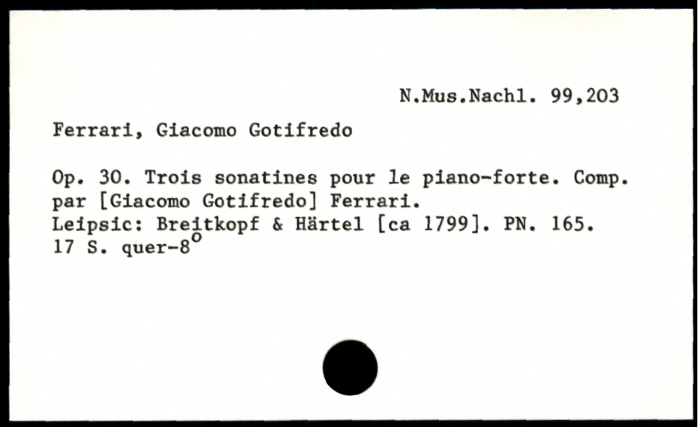
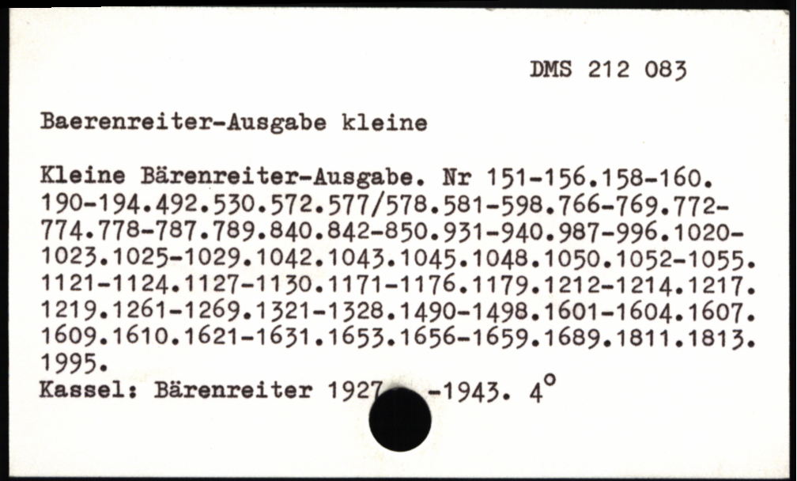

# Beispiele für problematische Karten

## Nicht unterscheidbare Zeichen
O oder 0:

## Fehlerhafte Annotationen

Bartholdÿ?

## Alte Schreibweisen
Charfreitag
Leipsic

## Schwierige Kartenstruktur

